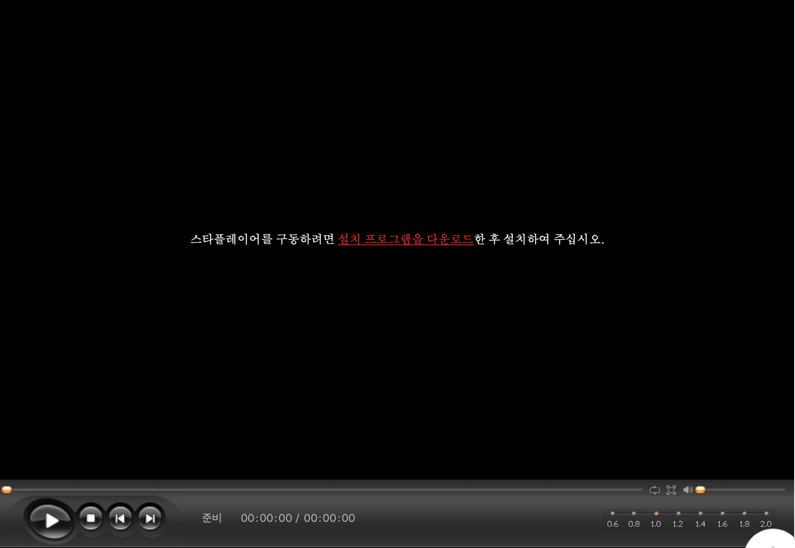
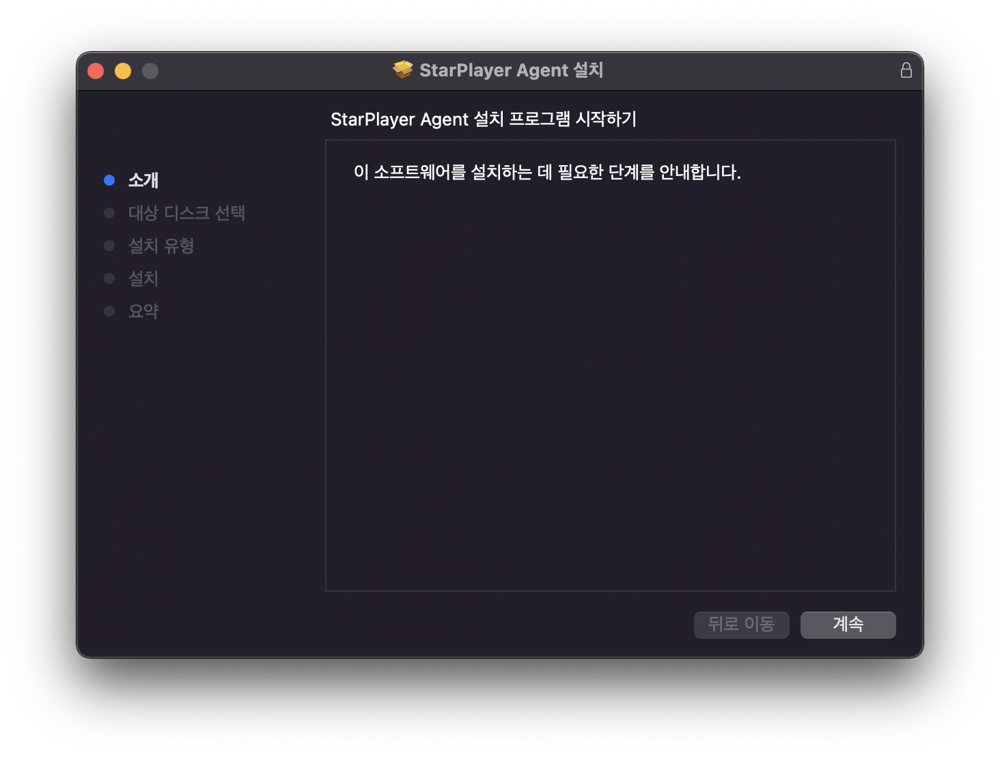
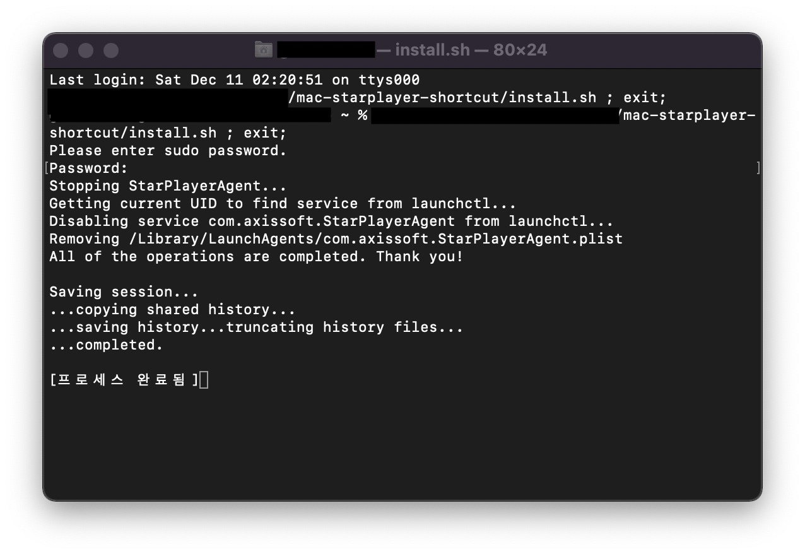
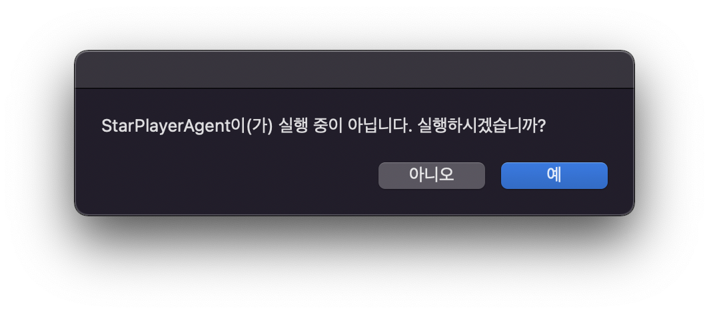
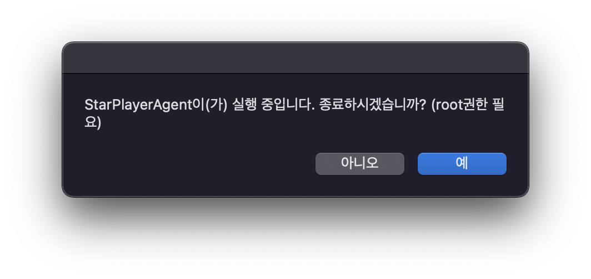

# 맥용 스타플레이어 실행/종료 스크립트

인터넷 강의 등에 쓰이는 StarPlayer가 데몬 형태로 실행됨에 따라 메뉴 막대 공간 낭비, 배터리 소모 증가 등 문제를 막기 위해 만들었습니다.

## 설치

[액시스소프트 스타플레이어 다운로드 사이트](https://www.axissoft.co.kr/solution_test_starplayer.php)로 접속합니다.

하단으로 스크롤을 내려 아래와 같은 화면이 나오면 빨간색 링크를 클릭하여 설치 파일을 다운로드합니다.

다운로드한 패키지 파일을 열어 설치를 진행합니다.

설치 종료 후 레포지토리를 클론하고 레포지토리 폴더 내부의 install.sh 스크립트를 실행합니다.

비밀번호를 입력하면 설치 스크립트에서 자동으로 스타플레이어를 종료하고 launchd 목록에서 제거해줍니다. 

설치 스크립트를 실행 완료 하였으면 재부팅해 줍니다.

## 사용법

설치 완료 후 StarPlayer Manager.app.zip 파일을 압축 해제한 후 StarPlayer Manager.app 파일을 실행하면 아래와 같은 창이 표시됩니다.

여기서 "예" 를 누르면 스타플레이어가 실행됩니다.

반대로 스타플레이어가 실행 중일 때 아래와 같은 창이 표시됩니다.

여기서 "예" 를 누르면 스타플레이어가 종료됩니다.